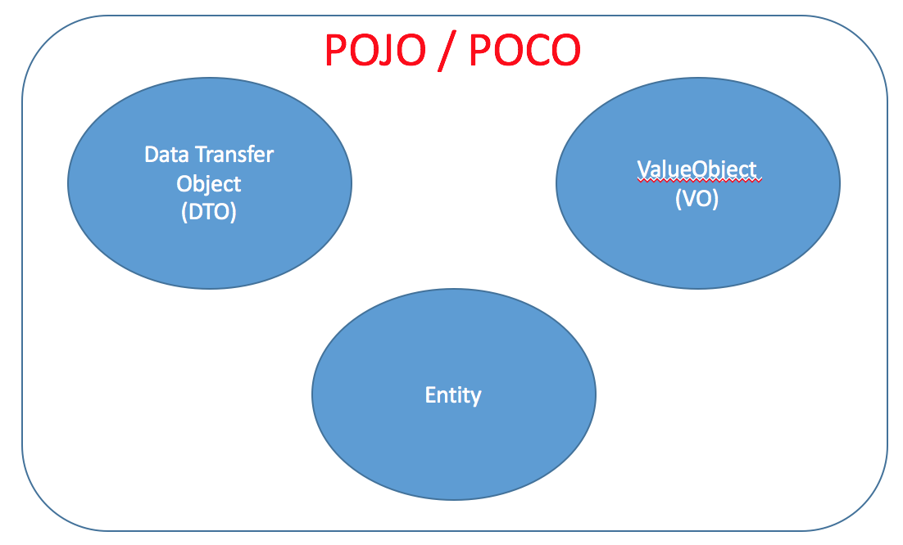
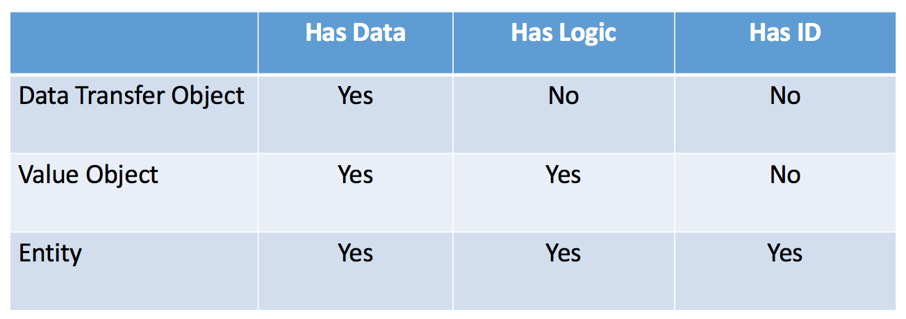
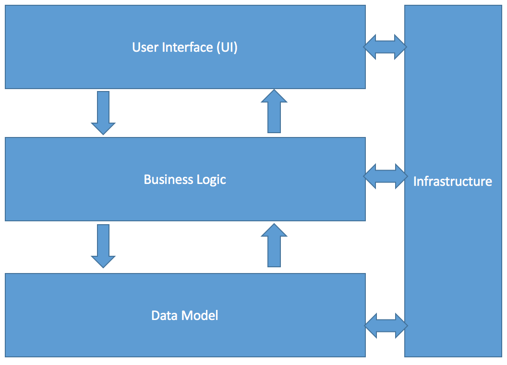
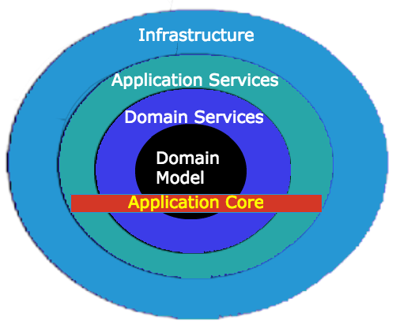
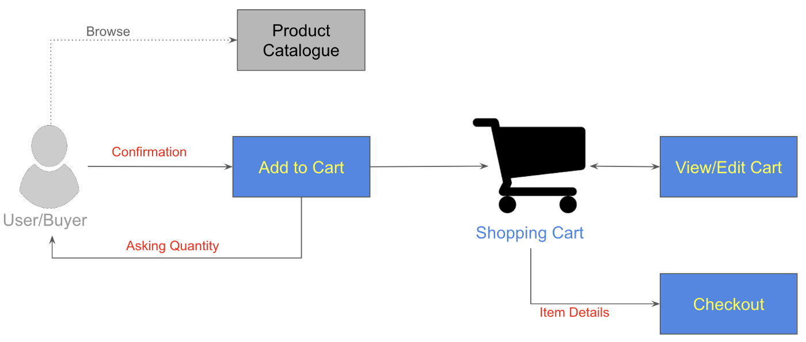

# Introducción 

La primera vez que oí hablar de DDD (**Domain Driven Design**, no Deadline Driven Design, por supuesto), todavía estaba trabajando como desarrollador senior de Java para Hewlett-Packard en su Centro de Desarrollo en Cyberjaya, Malasia. No estaba muy interesado en el tema ya que era difícil conseguir un buen recurso durante ese tiempo. Alguien me dijo que encontrara el libro de Eric Evan ("el libro azul"), y conseguí el libro y lo añadí a mi colección de PDF.

Durante este tiempo, DDD era bastante nuevo (especialmente en Indonesia), por lo que sólo unas pocas empresas habían implementado con éxito esta novedad. Y de alguna manera, encontré que muchos recursos de DDD eran demasiado difíciles de entender para la mayoría de los lectores (es decir, son demasiado abstractos y carecen de buenos ejemplos). Por lo tanto, estoy planeando retomar este impresionante tema y escribirlo en una serie, dotada de un ejemplo de aplicación para ser seguido paso a paso.

En esta primera parte de la Introducción, me gustaría empezar con algunos conceptos básicos como se escribe a continuación:

1. ¿Qué es DDD?
2. ¿Cómo empezamos?
3. ¿Qué debemos evitar en DDD?

¡Empecemos!
## 1. ¿De qué trata la DDD?

Para empezar esta sección, prefiero tomar la definición de una de las comunidades de DDD, dddcommunity.org, que describe DDD como un enfoque para desarrollar software para necesidades complejas conectando profundamente la implementación a un modelo evolutivo de los conceptos centrales del negocio.

Como la definición implica, DDD es adecuado si está construyendo software que tiene complejidad en su proceso de negocio (dominio de negocio). Por lo tanto, no todo el software es adecuado para DDD (por ejemplo, las aplicaciones CRUD no son adecuadas para ello ya que no son muy complejas).

El trabajo en equipo es muy importante en DDD, ya que es necesario mantener el contacto con los usuarios/clientes (también conocidos como expertos en el dominio). <u>Además, construyes el software para ellos, no para ti (has entendido bien el punto)</u>. Como alguien dijo: "el software puede fallar de dos maneras, construyes las cosas mal o construyes las cosas equivocadas". En ese caso, tienes que asegurarte de que entiendes el negocio que vas a construir. En esto consiste el DDD.

Para resumir, DDD puede describirse como una técnica para desarrollar software que se centra en la colaboración entre expertos técnicos y expertos del dominio. Por lo tanto, debemos mantener el enfoque con los expertos del dominio en lugar de los detalles de la materia técnica.
## 2. ¿Cómo empezamos?

Lo primero es lo primero, como se ha mencionado anteriormente, el gran punto es mantener el contacto con el **experto en el negocio/dominio**. Recapitularé varios puntos que podemos utilizar como guía mientras mantenemos una conversación con el experto en el dominio:

1. Aprender sobre el dominio del problema, es decir, el problema específico que el software en el que estás trabajando está tratando de resolver. Observar el panorama general del proceso empresarial actual.
2. Dividir el dominio en subdominios.
3. Centrarse en un subdominio a la vez con el **experto en el dominio**, y utilizar siempre un [lenguaje ubicuo](http://martinfowler.com/bliki/UbiquitousLanguage.html) para definir la terminología de trabajo.
4. Crear un [contexto delimitado](http://martinfowler.com/bliki/BoundedContext.html) entre los subdominios. De nuevo, el lenguaje ubicuo debe utilizarse siempre en todo el contexto delimitado, desde las conversaciones hasta el código, en el diagrama, en la pizarra, en el documento de diseño, en la discusión del equipo, etc. Se trata de utilizar el contexto delimitado en todas partes.
5. Lo ideal es que haya un equipo, una base de código y una base de datos diferentes para cada contexto delimitado.
6. Dado que todos trabajan para su contexto delimitado, son libres de cambiar cualquier cosa dentro de su contexto.
7. Para todas las cuestiones transversales que se comparten entre los contextos delimitados (lo llamamos **núcleo compartido**), cualquier cambio debe ser conocido y acordado entre todos los equipos de cada contexto delimitado.
8. Siempre hay que centrarse en los comportamientos del dominio más que en el estado del mismo (hay que favorecer un [modelo rico](http://www.slideshare.net/chris.e.richardson/building-rich-domain-models) en lugar de un [modelo anémico](http://www.martinfowler.com/bliki/AnemicDomainModel.html)).

Para resumir, utiliza siempre un lenguaje ubicuo (es decir, la misma terminología) en todo el equipo, divide el dominio en *subdominios* más pequeños y dale un aislamiento (es decir, un contexto delimitado) definiendo el límite y piensa en cómo el *subdominio* dentro del contexto delimitado puede comunicarse entre sí utilizando **interfaces/contrato de software elaborado**.

## 3. ¿Qué debemos evitar en DDD?

Por otro lado, durante nuestra implementación de DDD, debemos tener cuidado con ciertas prácticas que son demasiado comunes entre los desarrolladores de software. Estas son:

### 1. Utilizar una visión centrada en los datos al modelar el dominio del problema

Normalmente, el modelo de datos es lo primero que un arquitecto/desarrollador empieza a diseñar. Siempre consideran que los datos son lo más importante porque los datos son todo lo que necesitamos para informar. Si empiezas con DDD, debes cambiar esta mentalidad. Los datos por sí solos no tienen sentido. Sólo la lógica da un significado a los datos, y los mismos datos pueden tener un significado diferente en contextos diferentes. Por lo tanto, **debemos empezar con el contexto y la lógica en lugar de los datos**.

### 2. Centrarse en detalles de implementación como las entidades, los objetos de valor, los servicios, las fábricas y los repositorios en lugar de los conceptos básicos

Las entidades, los objetos de valor, los repositorios, etc., no tienen sentido hasta que hayamos definido el lenguaje ubicuo, los contextos delimitados y las interfaces/el contrato de software elaborado. Si empezamos demasiado pronto con los detalles de implementación como las entidades, es muy probable que el resultado sea un dominio anémico rodeado de un montón de servicios y lógica de negocio dispersos por todas partes.

### 3. Utilizar términos y conceptos genéricos y específicos del desarrollador al implementar la aplicación

Nunca debemos utilizar conceptos como guardar, actualizar, eliminar, manejar, gestionar, etc. Esos conceptos son demasiado técnicos, conceptos abstractos sin significado específico. En su lugar, debemos centrarnos en los conceptos de negocio. Esos conceptos mencionados (es decir, guardar, actualizar, etc.) no están relacionados con los conceptos empresariales. Para entender esto, me animo a imaginar siempre al cliente haciendo sus recados/negocios sin ordenadores (haciendo tareas específicas manualmente). Por lo tanto, siempre hay que pensar desde la perspectiva del experto en negocios/dominio, y dar un contexto claro al respecto. Evite los términos genéricos que pueden dar lugar a significados diferentes en contextos diferentes y no específicos.

### 4. Sobrevalorar las transacciones de la BD en lugar de centrarse en los procesos o transacciones de negocio

Dentro de DDD, las transacciones de negocio son más importantes que las transacciones de BD. Las transacciones de BD son *ACID*, *fuertemente consistentes* y de *corta duración*, mientras que las transacciones de negocio no lo son. De hecho, en la vida real, no conocemos las transacciones de la BD, sólo conocemos las transacciones de negocio. Por ejemplo, imagina que estás sentado en un restaurante y pides algo de comida o bebida. Dentro de la transacción del pedido, te des cuenta o no, habrá un proceso con algunas tareas asíncronas con muchos posibles cambios de estado inconsistentes; al final, todos los estados serán consistentes (*eventualmente consistentes*). Este proceso de caja negra funciona, es escalable y es ampliamente aceptado por todos. Por lo tanto, con DDD, no pienses nunca en transacciones de BD. En su lugar, piensa siempre en los procesos del mundo real, como las acciones (comportamientos) y sus posibles resultados, o cómo compensar las acciones si se producen fallos.

No es necesario que entiendas todos los puntos mencionados por ahora. Sé que la mayoría de los desarrolladores de aplicaciones no están demasiado familiarizados con los modismos y peculiaridades de esos conceptos. Solo sigue leyendo por ahora, y con suerte, se aclarará cuando lleguen las otras partes.

# Building Blocks

En esta segunda parte, continuaré con una de las cosas más importantes que hay que saber sobre DDD antes de seguir adelante con su implementación. Lo primero es lo primero: debes conocer los bloques de construcción de DDD que aparecen a continuación:

1. Entidades
2. Objetos de valor
3. Raíces agregadas
4. Repositorios
5. Fábricas
6. Servicios

Abróchense los cinturones!. Ahora repasamos los detalles de esos bloques.

## 1. Entidades

Una entidad es un objeto simple que tiene una identidad (ID) y es potencialmente mutable. Cada entidad se identifica de forma única por un ID y no por un atributo; por lo tanto, dos entidades pueden considerarse iguales (igualdad de identificadores) si ambas tienen el mismo ID aunque tengan diferentes atributos. Esto significa que el estado de la entidad puede cambiarse en cualquier momento, pero mientras dos entidades tengan el mismo ID, ambas se consideran iguales independientemente de los atributos que tengan.

## 2. Objetos de valor

Los objetos de valor son inmutables. No tienen identidad (ID) como la que encontramos en la entidad. Dos objetos de valor pueden considerarse iguales si ambos tienen el mismo tipo y los mismos atributos (aplicados a todos sus atributos). 

A menudo hay usos para una cosa como el paso de mensajes y, de hecho, esto es particularmente útil en la capa de la API dentro de una arquitectura de cebolla para exponer sus conceptos de dominio sin exponer necesariamente el aspecto inmutable.

Algunos beneficios de los objetos de valor:

1. El compuesto de objetos de valor puede tragarse mucha complejidad computacional.
2. Las entidades pueden ser liberadas de la complejidad lógica.
3. Mejoran la extensibilidad, especialmente para cuestiones de testabilidad y concurrencia si se utilizan correctamente.

## 3. Raíces agregadas

La raíz agregada es una entidad que se une a otras entidades. Además, la raíz del agregado es en realidad una parte del agregado (colección/grupo de objetos asociados que se tratan como una sola unidad a efectos de cambios de datos). Por lo tanto, cada agregado consta en realidad de una raíz de agregado y un límite. Por ejemplo, la relación entre Order y OrderLineItem dentro de SalesOrderDomain puede considerarse como un agregado en el que Order actúa como raíz del agregado, mientras que OrderLineItem es el hijo de Order dentro del límite de SalesOrder.

Una de las características clave de una raíz agregada es que los objetos externos no pueden tener una referencia a una entidad hija de la raíz agregada. Por lo tanto, si necesita acceder a una de las entidades hijas de la raíz del agregado (AKA aggregate), entonces debe pasar por la raíz del agregado (es decir, no puede acceder al hijo directamente).

La otra cosa es que todas las operaciones dentro del dominio deben, siempre que sea posible, pasar por una raíz agregada. Las fábricas, los repositorios y los servicios son algunas excepciones a esto, pero siempre que sea posible, si puedes crear o requerir que una operación pase por la raíz agregada, eso será mejor.

## 4. Repositorios

Los repositorios se utilizan principalmente para tratar el almacenamiento. En realidad, son uno de los conceptos más importantes en el DDD porque han abstraído muchas de las preocupaciones de almacenamiento (es decir, alguna forma/mecanismo de almacenamiento).

La implementación del repositorio podría ser un almacenamiento basado en archivos, o una base de datos (basada en SQL/NoSQL), o cualquier otra cosa que esté relacionada con el mecanismo de almacenamiento, como el almacenamiento en caché. También es posible cualquier combinación de ellos.

No hay que confundir un repositorio con el almacén de datos. El trabajo de un repositorio es almacenar las raíces agregadas. Por debajo de eso, la implementación de los repositorios puede tener que hablar con múltiples ubicaciones de almacenamiento diferentes para construir los agregados. Por lo tanto, una sola raíz agregada podría ser extraída de una API REST, así como de una base de datos o archivos. Usted puede envolver esos en algo llamado el almacén de datos, pero el repositorio es una especie de capa adicional de una abstracción en la parte superior de todos los almacenes de datos individuales. Por lo general, implemento el repositorio como una interfaz dentro de la capa de servicios de dominio/dominio dentro de la arquitectura de cebolla, y luego la lógica de implementación de la interfaz del repositorio se va a definir en la capa de infraestructura.

## 5. Fábricas

Las fábricas se utilizan para dar una abstracción a la construcción de objetos (ver [patrón de diseño de fábrica de GOF](http://www.oodesign.com/factory-pattern.html)).

Una fábrica también puede devolver potencialmente una raíz agregada o una entidad, o quizás un objeto de valor.
A menudo, cuando se necesita un método de fábrica para una raíz agregada, ésta se enrolla en el repositorio. Por lo tanto, su repositorio podría tener un método de creación de buscador en él.

Normalmente, las fábricas también se implementan como una interfaz dentro de la capa de servicios de dominio/dominio con la lógica de implementación se definirá en la capa de infraestructura.

## 6. Servicios

Un servicio existe básicamente para proporcionar un hogar para las operaciones que no encajan del todo en una raíz agregada. 

Por ejemplo, cuando se tiene una operación y no se sabe en qué raíz agregada va, tal vez opera en múltiples raíces agregadas o tal vez no pertenece a ninguna raíz agregada existente. Entonces, puede poner la lógica en un servicio. 

Sin embargo, no te apresures a poner todo en un servicio. En primer lugar, es mejor analizar cuidadosamente si la operación encaja en una de las raíces de agregado existentes. Si no pudiste encontrar la raíz agregada, posteriormente es mejor que te preguntes si has pasado por alto una raíz agregada, o tal vez hay conceptos de dominio que no has considerado y que deberían ser introducidos en tu dominio antes de poner la operación en un servicio.

## Otras cosas importantes

A menudo encuentro que muchos desarrolladores utilizan el término VO (value objects) y DTO (data transfer object) indistintamente. Piensan que ambos son lo mismo. Esto es bastante molesto para mí. Me gustaría aclarar aquí que ambos se refieren a cosas diferentes.

Como se muestra en la imagen de abajo, VO y DTO son subconjuntos de un POJO/POCO. Una entidad es también un subconjunto de POJO/POCO.

En la representación anterior, POJO y POCO pueden utilizarse indistintamente. Ambos se refieren a cosas similares. Ambos son simplemente objetos de dominio que representan principalmente el objeto de dominio/negocio dentro de la aplicación de negocio.

El término POJO (plain old Java object) fue acuñado por Martin Fowler y es muy popular en la comunidad Java, mientras que POCO (plain old CLR object/plain old class object) es ampliamente utilizado en el dotNet.

Como se mencionó anteriormente, DTO, VO y entidad son sólo un subconjunto de POJO/POCO. Sin embargo, son realmente cosas diferentes como se describe a continuación:

DTO es simplemente un estúpido contenedor de datos (sólo contiene datos sin ninguna lógica). Por lo tanto, es anémico en general (sólo contiene atributos y getter/setter). DTO es absolutamente inmutable. Usualmente, usamos DTO para transferir el objeto entre capas y niveles en una sola aplicación o entre aplicación a aplicación o [JVM a JVM](https://dzone.com/articles/jvm-architecture-explained) (mayormente útil entre redes para reducir múltiples llamadas de red).

VO también es inmutable, pero lo que lo hace diferente a DTO es que VO también contiene lógica.

Eso es todo por ahora. Lee la siguiente parte aquí.

# Arquitectura de cebolla

Dentro de esta parte en particular, voy a hablar de una de mis arquitecturas favoritas llamada "Arquitectura Cebolla". Sin embargo, permítanme recapitular primero sobre lo que tenemos hasta ahora sobre DDD como sigue:

>DDD trata de cómo diseñamos nuestro software desde la **perspectiva del negocio**, no desde la perspectiva técnica. Para ello, debemos ir de la mano del experto en el dominio (también conocido como experto en el negocio) durante el proceso de diseño, para así poder mantenernos alineados con lo que el negocio quiere. 
>
>El proceso siempre comienza con lo que llamamos **lenguaje ubicuo** (es decir, necesitamos tener un término estándar que se utilice durante el proceso de diseño e implementación). 
>
>Posteriormente, *se divide el dominio complejo en sub-dominios* más pequeños conocidos como **contexto delimitado** y se definen cuidadosamente los límites y el contrato utilizado para comunicarse entre el contexto delimitado individual. De este modo, cada contexto delimitado aparece como una caja negra para otro (sólo hay que preocuparse por la interfaz del contrato, sin necesidad de preocuparse por los detalles de la implementación, ya que están ocultos desde el exterior).
>
>Además, hay algunas trampas que hay que evitar durante el diseño y la implementación. Estos son la mentalidad centrada en los datos cuando se modela el dominio del problema, centrándose en los detalles de la implementación como las entidades, los repositorios, etc. en lugar de los conceptos básicos, los términos técnicos genéricos y específicos, y centrarse en las transacciones de la base de datos en lugar de las transacciones de negocio.

La **Arquitectura Cebolla** fue acuñada por Jeffrey Palermo. Si alguna vez has oído hablar de la **Arquitectura Hexagonal** (también conocida como **Puerto y Adaptadores**) de Alistair Cockburn, la idea de la Arquitectura Cebolla en realidad se inspiró en esta **Arquitectura Hexagonal**.

No tienes que usar la Arquitectura Cebolla aunque implementes DDD. Y no estás obligado a usar DDD también para aplicar la Arquitectura Cebolla. Ambas son independientes entre sí. Por lo tanto, eres libre de usar otra arquitectura que no sea la Arquitectura de la Cebolla para DDD (incluso la arquitectura tradicional como MVC todavía encaja en DDD). Sin embargo, la Arquitectura de la Cebolla es un candidato fuerte y adecuado para DDD.

¿Qué es lo que hace que la Arquitectura de Cebolla sea diferente a la tradicional? Veamos primero la tradicional y luego la Onion.

En la arquitectura tradicional, la estructura de la aplicación se compone de tres niveles/capas como se muestra a continuación:

Como podemos ver, en esta arquitectura particular, cada capa depende en gran medida de las capas por debajo de ella, y cada capa normalmente también dependerá de algunas infraestructuras comunes (por ejemplo, marcos o servicios de utilidad). Con este tipo de arquitectura, será difícil dar una separación de preocupaciones debido al acoplamiento creado entre cada capa (cada capa está acoplada a las capas por debajo de ella, y cada capa a menudo acoplada a varias preocupaciones de infraestructura). Sí, el acoplamiento es importante para crear la interacción entre los componentes de nuestro sistema, pero lo que estoy tratando de decir aquí es que esta arquitectura particular crea un acoplamiento innecesario.

Por ejemplo, digamos que el equipo ha decidido utilizar SpringBoot para construir sus microservicios que representan la capa de infraestructura. Posteriormente, después de un par de años, el equipo ha decidido cambiar el marco de trabajo a otro o tal vez simplemente abandonar SpringBoot. Con este tipo de arquitectura, será difícil desplegar el nuevo framework sin ningún ajuste (cambios) en las otras capas, ya que cada capa está altamente acoplada a la capa del framework (infraestructura). Así, habrá una posibilidad para el equipo en romper la capa de negocio actual que contiene toda la lógica de negocio (dominio de negocio). Hay que tener en cuenta que un buen sistema debe tener el criterio MECE (Mutually Exclusive Comprehensively Exhaustive), es decir, "*débilmente acoplado, altamente cohesionado*". Por lo tanto, cuanto más acoplamiento crees en tu sistema, más esfuerzo necesitarás para cambiar el sistema y dividirlo en pequeñas partes independientes.

Por otro lado, el mayor infractor (y más común) es el acoplamiento de la interfaz de usuario y la lógica de negocio con el acceso a los datos. Las dependencias transitivas siguen siendo dependencias. La interfaz de usuario no funcionará si la lógica de negocio no está ahí, al igual que la lógica de negocio no funcionará si el acceso a los datos no está ahí. El acceso a los datos cambia con frecuencia, y cada vez que el acceso a los datos cambia, también tendrá que ajustar / cambiar la capa de negocio con esta arquitectura particular. Y, ¿he mencionado antes? Cambiar la capa de negocio que contiene la regla de negocio tendrá un gran riesgo para la empresa, especialmente cuando el negocio ya es estable y el sistema actual ha sido ampliamente utilizado por los usuarios en la empresa.

Aquí es donde la Arquitectura de Cebolla viene al rescate :-). Echa un vistazo al siguiente diagrama de la Arquitectura de la Cebolla.

Hay muchos aspectos de la Arquitectura de la Cebolla, pero el objetivo principal es cómo controla el acoplamiento. La regla básica que hay que tener en cuenta es que todo el acoplamiento es hacia el centro. Por ejemplo, en el diagrama representado podemos decir lo siguiente:

1. La capa "Infraestructura" conocerá los "Servicios de Aplicación", los "Servicios de Dominio" y el "Modelo de Dominio".
2. Los "Servicios de Aplicación" conocerán los "Servicios de Dominio" y el "Modelo de Dominio".
3. Los "Servicios de Dominio" sólo conocen el "Modelo de Dominio".
4. El "Modelo de Dominio" sólo se conoce a sí mismo.
5. La capa interna no sabrá ni deberá saber de la capa externa. Por lo tanto, el "Modelo de Dominio" no conoce los "Servicios de Dominio", los "Servicios de Aplicación" y la capa de "Infraestructura". Al igual que los "Servicios de Dominio" no conocen la capa de "Servicios de Aplicación" e "Infraestructura", y así sucesivamente.

En el centro, vemos el "Modelo de Dominio" que representa el estado y el comportamiento del modelo para la Organización/Empresa (es decir, la aplicación que estamos tratando de construir). Alrededor del modelo de dominio hay otras capas con más comportamiento donde el número de las capas puede variar (es decir, no hay restricción del número de las capas).

El "Núcleo de la Aplicación" pegará todas las capas como el "Modelo de Dominio", los "Servicios de Dominio" y los "Servicios de Aplicación" (de nuevo, el número de capas puede variar, lo que significa que podemos tener más capas en lugar de sólo esas 3 capas).

El "Modelo de Dominio" es el centro mismo, y como todo el acoplamiento es hacia el centro, entonces el "Modelo de Dominio" debe estar acoplado sólo a sí mismo como se mencionó antes.

**Típicamente, el "Modelo de Dominio" consiste en una colección de interfaces llamadas Interfaces de Repositorio que proporcionan un mecanismo de almacenamiento y recuperación de objetos en el sistema.** Por lo tanto, puedo decir que el "Modelo de Dominio" define el contrato del comportamiento del sistema del objeto, especialmente para los mecanismos de almacenamiento y recuperación. Recuerde, sólo las interfaces (no la implementación). Podemos dejar la implementación más tarde en diferentes capas (es decir, la capa de infraestructura).

La capa exterior (es decir, la capa de "Infraestructura") está reservada para las cosas que cambian con frecuencia. Estas cosas deberían estar aisladas del "núcleo de la aplicación". UI, Automation Test, DatabaseAccess, NetworkAccess, FileAccess pertenecen a esta capa de "Infraestructura".

Entonces, ¿cómo se relaciona esta "Arquitectura de Cebolla" con "DDD"? Lee [aquí](https://yauritux.medium.com/ddd-part-iv-94a8c88504c0).

# DDD y microservicios

Ahora... dentro de esta parte, trataré de elaborar la arquitectura de microservicios y su relación con el **Diseño Dirigido por Dominio** (DDD).

## Arquitectura de microservicios

Lo primero es lo primero: vamos a describir en qué consiste la **arquitectura de microservicios**.

**La arquitectura de microservicios** es un tipo de patrón arquitectónico que se centra en el desarrollo/construcción de servicios pequeños, reutilizables y escalables. Los microservicios nos permiten dividir nuestro gran sistema en un número de procesos independientes que colaboran, por lo que puede ayudar a evitar una gran aplicación monolítica, que es difícil de mantener, especialmente si tienes grandes proyectos con un gran equipo.

Los microservicios también pueden ser muy útiles cuando se tienen que crear servicios para dispositivos políglotas como los wearables, el Internet de las Cosas (IoT), el móvil, el escritorio y la web.

Los microservicios en sí no son un término nuevo. Fue acuñado en 2005 por el Dr. Peter Rodgers, que mencionó los microservicios web basados en SOAP. Se ha hecho más popular desde 2010.

Las claves de la arquitectura de microservicios son:

1. Es desplegable de forma independiente en cuanto a la pila, el marco de trabajo y/o los lenguajes utilizados.
2. Se despliega como un pequeño servicio que sigue centrándose en hacer una cosa bien, es decir, servicios orientados al dominio.
3. Interfaces bien definidas y funcionalidad mínima.
4. Evitar los fallos en cascada y las llamadas sincrónicas - diseño reactivo para el fallo.
5. Cada servicio tiene sus propios datos y utiliza eventos/mensajes para comunicarse con otros servicios.
6. Cada servicio se despliega de forma independiente y aislada de otros servicios (normalmente se ejecuta en su propio contenedor) y es automáticamente escalable.

El objetivo principal es proporcionar un pequeño conjunto de servicios independientes que se ejecutan de forma autónoma en diferentes entornos, pero que pueden comunicarse entre sí (cohesión estrecha). Como sabemos, el acoplamiento es una bestia de dos cabezas. Por un lado, el código fuertemente acoplado es difícil de probar, difícil de mantener/reutilizar, y suele mostrar un comportamiento de "whack-a-mole" (es decir, arreglar un fallo probablemente producirá uno o más fallos nuevos). Por otro lado, también es necesaria una cierta cantidad de acoplamiento, ya que el código completamente desacoplado no hace nada; por lo tanto, el acoplamiento es necesario, pero debe gestionarse cuidadosamente. Esto es lo que llamamos "Acoplamiento flojo, cohesión alta/baja".

## Ventajas de los microservicios

1. Fácil de escalar como componentes individuales.
2. Fácil de desplegar y reducir el tiempo de despliegue, es decir, puede desplegar cada módulo sin interrumpir ningún otro módulo.
3. Fácil de mantener debido a su menor tamaño de código, y puedes tener un equipo pequeño y enfocado.

## Desafíos de los microservicios

1. Es difícil lograr una fuerte consistencia en los servicios distribuidos.
2. Es más difícil depurar y rastrear los problemas en comparación con las aplicaciones monolíticas.

Hay muchos otros desafíos que usted mismo conocerá más adelante, una vez que implemente los microservicios. Sin embargo, dependerá de cómo diseñes y gestiones tus microservicios siguiendo algunas de las mejores prácticas conocidas, como la gestión de APIs, la gestión del tráfico, la monitorización de servicios, etc. Intentaré encapsularlas más adelante en otra serie, si tengo la oportunidad.

## ¿Cómo se relaciona el DDD con los microservicios?

Como se mencionó anteriormente, en los microservicios, construimos cada servicio para servir sólo una cosa y hacer una cosa bien. Además, cada servicio está aislado de los demás. En este sentido, los principios de DDD pueden ayudarnos a mantener el alcance del servicio pequeño a través de lo que llama "Bounded Context".

Posteriormente, DDD te va a ayudar a investigar y conocer bien tu dominio y todos los subdominios a través de la comunicación que construyas con los expertos del dominio. Al conocer bien tu dominio y subdominios, conocerás los contextos del mapa y cómo interactúan todos los subdominios entre sí, lo que te ayudará a diseñar y elegir el tipo de tu arquitectura de microservicios y qué tipo de enfoques utilizas para implementarlos, si un enfoque reactivo, de orquestación, o híbrido... dependerá de tu conocimiento sobre el dominio en el que estás trabajando. Hay pros y contras para cada enfoque que necesitan ser evaluados en base al proyecto y a tu conocimiento del dominio. DDD te ayudará a tomar una decisión al respecto.

# Implementación en código

Algunos de ustedes que probablemente han leído mi serie anterior sobre el DDD, puede darse cuenta de que deliberadamente he cambiado un poco las secuencias de la historia. Esto se debió a que recibí algunos mensajes pidiéndome que diera el ejemplo de código [hablar es barato, muéstrame el código ~ Linus Torvalds] :-). Por lo tanto, mantendré la sección de ES y CQRS para la última parte. Otra cosa, voy a usar go (golang) aquí ya que he estado trabajando con él últimamente. La versión con la que estoy trabajando actualmente es la 1.13.4.

Así que, vamos a empezar...

Para la implementación del código, voy a empezar por implementar algunas de las funcionalidades dentro del carrito de la compra ya que es bastante sencillo. Creo que hoy en día todo el mundo sabe cómo funciona (al menos la mayoría de nosotros ha comprado alguna vez algo online).

En primer lugar, voy a mostrar a continuación el proceso común de la cesta de la compra. Tenga en cuenta que lo que voy a mostrar aquí se limita al contexto limitado de la cesta de la compra, lo que significa que sólo nos centraremos en el proceso de cómo el usuario/comprador elige el artículo y la adición de ese artículo en particular en su carro, posteriormente, continuar con la compra. En cuanto a la parte de facturación/pago, será en el contexto delimitado del servicio de pago.

Vale la pena mencionar aquí, que lo que está resaltado en color gris estaba fuera de nuestro `contexto de carrito de compras`. Por lo tanto, no nos ocuparemos de los detalles esenciales de esos objetos dentro de nuestra implementación de código, ya que esas cosas estarían en otros servicios (por ejemplo, `el servicio de catálogo de productos` y `el servicio de usuario`). Sin embargo, seguiremos teniendo esos objetos dentro de nuestro código, en el `contexto` de lo que necesita nuestro carrito de la compra. Por ejemplo, no necesitaremos la información de las credenciales del usuario en nuestra `cesta de la compra`, ya que eso debería ser atendido desde el `contexto del servicio de usuario`. Básicamente, sólo necesitamos la información del usuario que está relacionada con el carro de la compra, como: `user_session_id`, `dirección de envío`, `dirección de facturación` (además, la información de la dirección también debe ser atendida desde otro servicio, por ejemplo: `servicio de dirección`, incluso esto es opcional).

Otra cosa, no voy a utilizar exactamente la arquitectura de la cebolla aquí. En su lugar, utilizaré l<u>a arquitectura de código limpio</u> que fue promovida por Robert C. Martin, también conocido como Tío Bob. En mi opinión, ambas son bastante similares, sólo que tienen diferentes términos para explicar la estructura de sus capas. Sin embargo, a menudo uso todos los términos de esas dos arquitecturas indistintamente dentro del código. Por lo tanto, no se confunda con él ..., sólo tratando de centrarse con la arquitectura de capas y también las cosas par de estas reglas siguientes:

1. La dependencia entre las capas debe ir hacia adentro en una dirección. En lo que a mí respecta, fue diseñado así para evitar cualquier dependencia circular.
2. Una capa debe depender sólo de una capa directa (un nivel) por debajo de ella, no debe conocer ninguna capa más allá de ese nivel. Por ejemplo, A sobre B ( A →B ), y B depende de C ( B →C ), pero A no debería saber nada sobre C.
3. Cada capa debería depender de la abstracción ( interfaz ) en lugar de la implementación. Esto cumple con lo que el tío Bob dijo sobre 2 reglas para arreglar los problemas de RFI, puedes leerlo en mi antiguo blog [aquí](https://yauritux.wordpress.com/2011/04/03/history-of-dependency-injection-di/).

Empecemos por ver algunos bloques de construcción básicos de DDD para nuestro carrito de la compra como se muestra arriba.

De acuerdo con lo que escribí aquí, hay algunos bloques de construcción técnica dentro de DDD, es decir, Entidad, Objeto de Valor, Agregado, Repositorio, y así sucesivamente. Puedes visitar ese enlace de nuevo para aclarar las diferencias entre todas esas cosas. No todas esas cosas son necesarias cuando estamos comenzando a implementar nuestro código, así que sólo pega lo que necesitamos según el caso (`YAGNI`).

> .....

Hay mucho código fuente, por lo que mejor será revisar directamente a la entrada del blog [Yauritux en medium.](https://yauritux.medium.com/ddd-part-5-b0caf2437912)

Traducción por interés personal desde [DZone](https://dzone.com/articles/ddd-part-i-introduction)