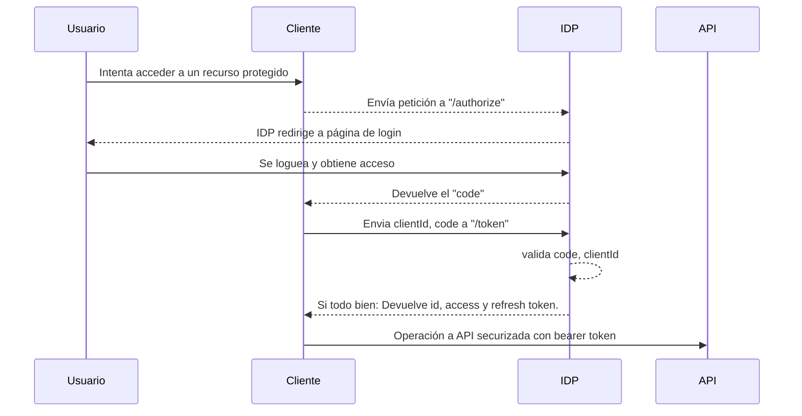
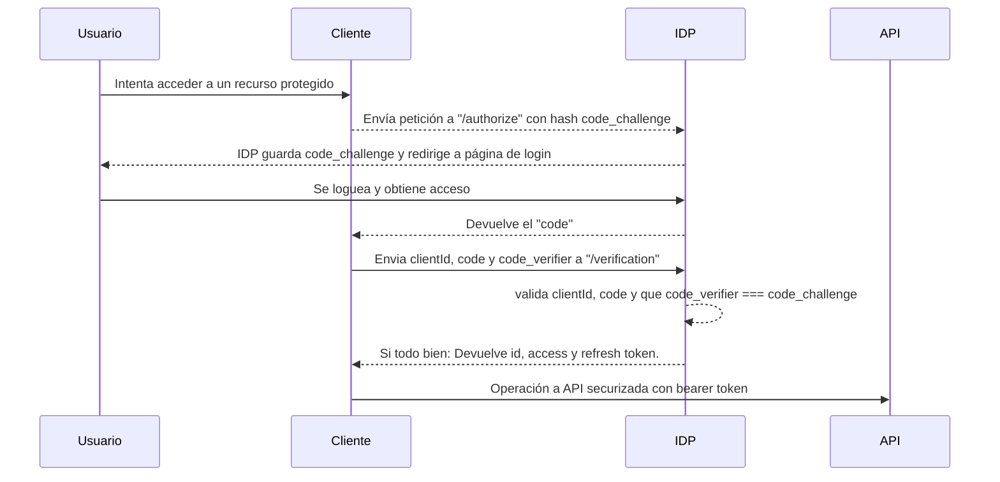

# Authorization Code Grant 

"Public clients" a mi parecer, pues he quitado "secret" cuando envía "clientid,code a /token" ... e una webapp no puedes tener almacenado el secret porque no es un confidential app, sino un public app.

## Without PKCE

## With PKCE

"Enviar en primera instancia un dato aleatorio que cifrará el target y que tendré que proveer tras login junto con el <<code>> que me da para verifique que quien solicita los tokens es capaz de enviar tanto el primer dato aleatorio como el que ha recuperado cifrado y el code"

