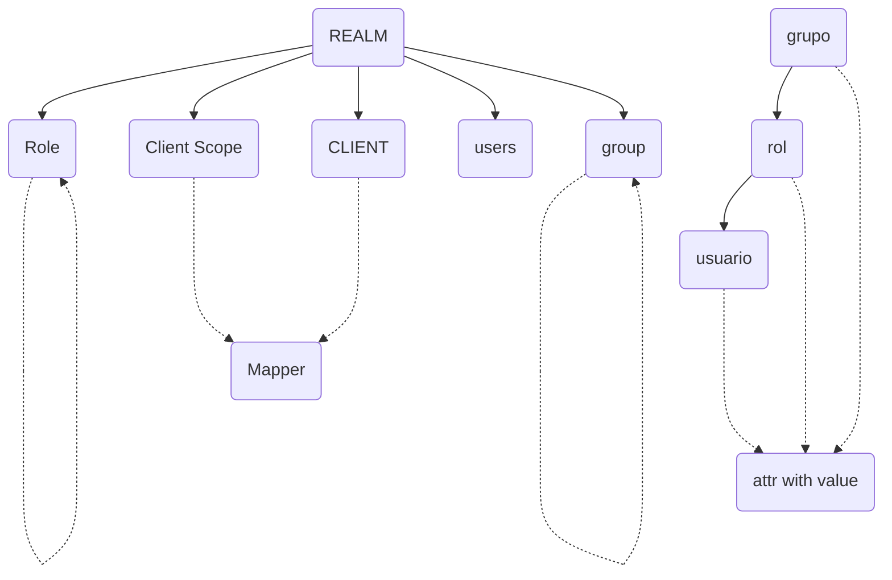
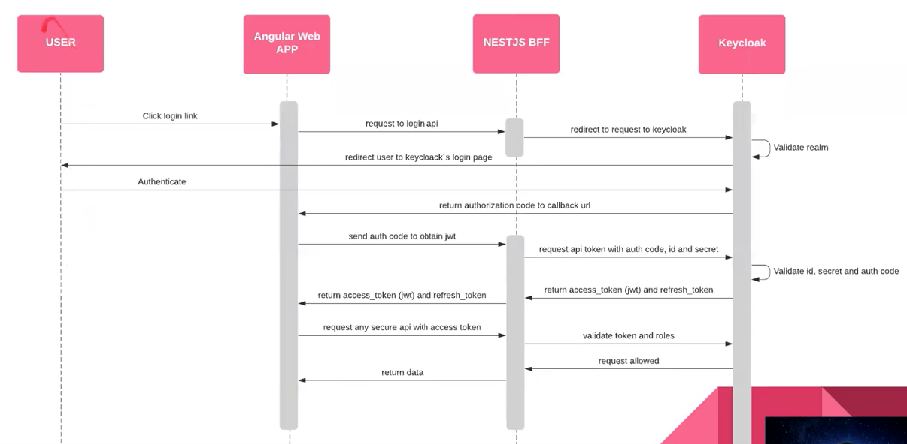

# Organización

* **Reino**: Contexto general para SSO
* **Usuario**: Base de usuarios para todo el reino
  * **Attributes**: Campos asignables a un usuario, con un valor concreto. No se trata de definición de un listado de posibles atributos, son ya los atributos asignados a dicha entidad.
* **Grupo**: Los Grupos son simplemente una colección de usuarios a los que se les puede aplicar roles y atributos en un solo lugar. Son jerarquizables y por tanto heredan todo lo de su padre.
  * **Attributes**: Campos asignables a un grupo, con un valor concreto. No se trata de definición de un listado de posibles atributos, son ya los atributos asignados a dicha entidad.
  * Los usuarios pueden ser miembros de cero o más grupos. Los usuarios heredan los atributos y la asignación de roles asignados a cada grupo
* **Cliente**: Entidad que puede requerir autenticación (OpenID) a usuarios.
  * **Mappers**: Se trata de especificar qué información irá incluida en los token de ID y acceso, elegible por configuración.
* **Client Scope**: Client scopes allow you to define a common set of protocol mappers and roles, which are shared between multiple clients
  * **Mappers**: Se trata de especificar qué información irá incluida en los token de ID y acceso, elegible por configuración.
* **[Role](https://wjw465150.gitbooks.io/keycloak-documentation/content/server_admin/topics/roles.html)**: Los roles definen un tipo de usuario y las aplicaciones asignan permisos y control de acceso a los roles
  * **Attributes**: Campos asignables a un rol, con un valor concreto. No se trata de definición de un listado de posibles atributos, son ya los atributos asignados a dicha entidad.

