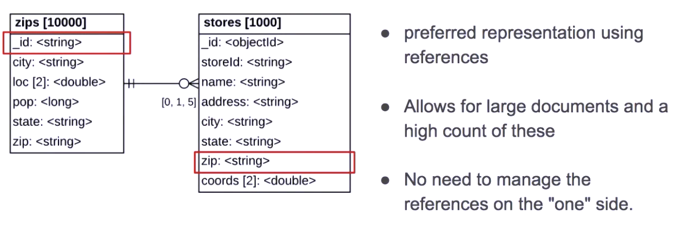

 

* 1-1: grouping two pieces of data in the same entity or doc
* 1-N: embedded data.
  * Hay que tener cuenta la posible longitud del array si es entidad fuerte
  * Para ello pensar si hay un min, cantidad común y/o máximo sobre elementos del array. Véase no es lo mismo meter posibles hijos de un padre que metet seguidores de una red social de un usuario
  * Se usa en mdb la nomenclatura en Crowl notation de [min, common, max]
* N-N: to a doc

# One-To-Many 

Son las relaciones más comunes:

## Embeber en el “one” side de una relación one-to-may

Cuando el doc principal es el objeto de consulta y lo embebido no se consultará de forma indivudalizada.

La información que se necesita “junta”, está junta

## Embeber en el “many” side:

Cuando el “one” side representa una información que puede ser volátil o de probable modificación

El ejemplo lo pone sobre pedidos y direcciones de entrega. Que el usuario en el futuro si cambia su dirección de entrga, dado que está hardcoded e implicita en el pedido, por mucho que la cambie en los pedidos pasados no cambiará su información.

## Reference in the “one” side:

La referencia 	la hace sobre un id por encima de _id (en el ejemplo, no es una 	directriz, pero no deja de ser curioso)

MongoDB no 	tiene onUpdate/Delete cascade, se delega a la aplicación que 	maneja los datos.

## Reference in the “many” side

  - Aquí si ha 	relacionado el campo del many side con el _id de MongoDB

  - Si usamos este 	mecanismo, no habrá necesidad de onUpdate/Delete on cascade, ya 	que en el momento que eliminado el lado “one”, deja de existir 	referencia “many” side

- 

   

## Recapitulación

# Many-to-Many relationships

En relaciones N:N dónde se genera una tabla puente que acaba teniendo 2 relaciones de one-to-many, mongodb dice que será mejor duplicar el dato para cada documento que tener uno referenciado por varios. De forma que las operaciones de actualización para una entidad concreta son más sencillas y el coste mayor sería que aplicase realmente a todas las entidades.

* Pasar de esto: 

* A esto otro: 
  

## Recapitulación

# Handling Duplication, Staleness and Integrity

1. Dupication: duplicating data across documents

2. Data staleness: accepting staleness in some pieces of data

3. Data integrity issues: writing extra application side logic to ensure referentiual integrity

Choosing a pattern to be applied to your schema requires takinginto account these three concerns. If these concerns are more important than the potential simplicitu of performance gains provided by the parttern, you should not use the pattern.

## Handling Duplication

Let's start with the concern of duplication.

**Why do we have duplication?**

It is usually the result of embedding information in a given document for faster access.

The concern is that it makes handling changes to duplicated information a challenge for correctness and consistency, where multiple documents across different collections may need to be updated.

There is this general misconception that duplication should not exist.

**In some cases, duplication is better than no duplication.**

However, not all pieces of information are affected in the same way by duplication.

Let's start with a situation where duplicating information is better than not doing it.

Let's link orders of products to the address of the customer that placed the order by using a reference to a customer document.

Updating the address for this customer updates information for the already fulfilled shipments, order that have been already delivered to the customer.

This is not the desired behavior.

The shipments were made to the customer's address at that point in time, either when the order was made or before the customer changed their address.

**So the address reference in a given order is unlikely to be changed.**

**Embedding a copy of the address within the shipment document will ensure we keep the correct value.**

When the customer moves, we add another shipping address on file.

Using this new address for new orders, does not affect the already shipped orders.

**The next duplication situation to consider is when the copy data does not ever change.**

Let's say we want to model movies and actors.

Movies have many actors and actors play in many movies.

So this is a typical many-to-many relationship.

Avoiding duplication in a many-to-many relationship requires us to keep two collections and create references between the documents in the two collections.

If we list the actors in a given movie document, we are creating duplication.

However, once the movie is released, the list of actors does not change.

So duplication on this unchanging information is also perfectly acceptable.

This leaves us with the last duplication situation, the duplication of a piece of information that needs to or may change with time.

For this example, let's use the revenues for a given movie, which is stored within the movie, and the revenues earned per screening.

Oh, yeah, with said duplication add to be a single value in two locations.

In this case, we have duplication between the sum store in the movie document and the revenue store in the screening documents used to compute the total sum.

This type of situation, where we must keep multiple values in sync over time, makes us ask the question is the benefit of having this sum precomputed surpassing the cost and trouble of keeping it in sync?

If yes, then use this computed pattern.

If not, don't use it.

Here, if we want the sum to be synchronized, it may be the responsibility of the application to keep it in sync.

Meaning, whenever the application writes a new document to the collection or updates the value of an existing document, it must update the sum.

Alternatively, we could add another application or job to do it.

But how often should we actually recalculate the sum?

This brings us to the next concern we must consider when using patterns, staleness.

## Handling Staleness

Staleness is about facing a piece of data to a user that may have been out of date.

We now live in a world that has more staleness than a few years ago.

Due to globalization and the world being flatter, systems are now accessed by millions of concurrent users, impacting the ability to display up-to-the-second data to all these users more challenging.

For example, the availability of a product that is shown to a user may still have to be confirmed at checkout time.

The same goes for prices of plane tickets or hotel rooms that change right before you book them.

Why do we get this staleness?

New events come along at such a fast rate that updating data constantly can cause performance issues.

The main concern when solving this issue is data quality and reliability.

We want to be able to trust the data that is stored in the database.

The right question is, for how long can the user tolerate not seeing the most up-to-date value for a specific field.

For example, the user's threshold for seeing if something is still available to buy is lower than knowing how many people view or purchase a given item.

When performing analytic the queries it is often understood that the data may be stale and that the data being analyzed is based on some past snapshot.

Analytic queries are often run on the secondary node, which often may have stale data.

It may be a fraction of a second or a few seconds out of date.

However, it is enough to break any guarantee that we're looking at the latest data recorded by the system.

The solution to resolve staleness in the world of big data is to batch updates.

As long as the updates are run within the acceptable thresholds, staleness is not a significant problem.

So, yes, every piece of data has a threshold for acceptable staleness that goes from 0 to whatever makes sense for given piece of information.

A common a way to refresh stale data is to use a Change Stream to see what has changed in some documents and derive a list of dependent piece of data to be updated.

Change Stream's a new application to access and respond to data changes, either in real time or in a delayed mode.

Please consult our docs for a complete description of this MongoDB feature.

## Handling Referential Integrity

Our third concern, when using patterns, is referential integrity.

Referential integrity has some similarities to staleness.

It may be OK for the system to have some extra or missing links, as long as they get corrected within the given period of time.

Why do we get referential integrity issues?

Frequently, it may be the result of deleting a piece of information [INAUDIBLE] document-- for example, without deleting the references to it.

In the big data world, we can also associate referential integrity issues to adding distributed system, where a related piece of information live on different machines.

At this time, the MongoDB server does not support foreign keys and associated cascading deletes and updates responsible for keeping referential integrity.

It is the responsibility of the application to do so.

Here again, the main concern is data quality and reliability.

For delayed referential integrity, we can, again, rely on change streams.

For keeping the referential integrity [INAUDIBLE],, we can avoid using references by embedding information in a single document, instead of linking it.

Or we can use MongoDB with be multi-document transactions to update multiple documents at once [INAUDIBLE: ¿in a data big way?]..

To recap, we can tame these three concerns-- duplication, staleness, and referential integrity-- by understanding the following for every piece of data in your database.

Should or could the information be duplicated or not?

And if it has to be duplicated and consistently updated, resolve the duplication with bulk updates.

What is the tolerated or acceptable staleness?

Resolve with updates based on change streams.

Which pieces of data require referential integrity?

Resolve or prevent inconsistencies with change streams or transactions.

