**Duplicación**:  En algunos casos la repetición es mejor que la no duplicación. Sin mebargo, no todas las piezas de información son afectadas de la mimsa forma en la duplicación.

* A: Direcciones de clientes para sus ordenes de producto.
  * Si actualizasemos la dirección de usuario se modificarían sus pedidos pasados.
  * 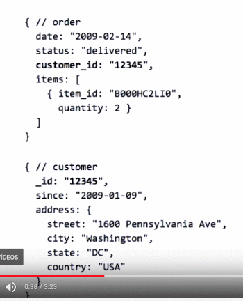
* B: Cuando lo copiado no cambiará nunca
  * Películas y actores en ellas una vez son lanzadas
  * Se puede copiar la info básica de cada actor  y dejar el resto de características extendidas en la propia ficha/documento del actor.
  * 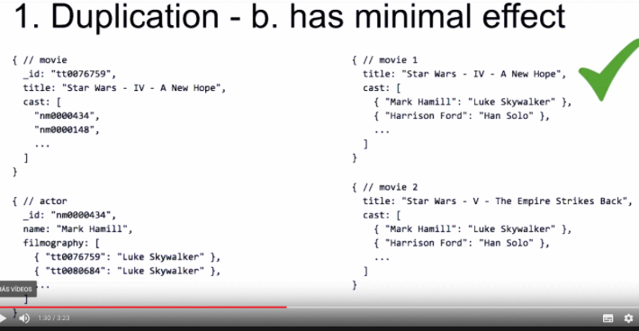
* C: Información que necesita o puede cambiar con el tiempo:
  * Las ganancias para una película por visualización
  * Se irá incrementando las ganancias por visualización y por tnato el campo sumatorio del documento principal habrá que actuliarlo.
  * 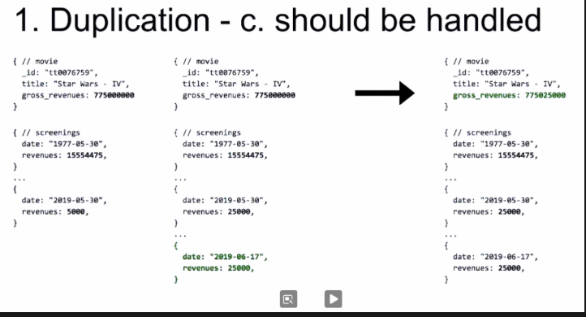

**Anquilosamiento**: 

​	Se trata de mostrar piezas de información a un usuario que puede estar desfasadas. Esto ocurre porque nuevos eventos se recien en un ratio muy alto que actualizan datos constantemente y puede causar problemas de rendimiento.

​	*La principal preocupación al resolver esto es la calidad y confianza de los datos almacenados.*

​	La cuestión principal es ¿por cuánto tiempo un usuario puede tolerar no ver la información actualizada? por ejemplo: `el umbral del usuario para ver si algo está todavía disponible para comprar es más bajo que saber cuántas personas ven o compran un determinado artículo`

​	La solución en el mundo del big data son `Batch Updates`. *Change Streams* es la forma de actualizar datos anquilosados.

**Integridad Referencial**:

Puede estar bien para algunos sistemas tener algnos datos o enlaces rotos en función del tiempo que permanezcan así.

Esto ocurre cuando se borra un documento sin eliminar las referencias a éste, o si el borrado parcial nos sitúa en el mismo contexto.

MongoDB no soporta actualización ni borrado en cascada ni claves foráneas, este mantenimiento es responsabilidad de la aplicación.

​	*La principal preocupación al resolver esto es la calidad y confianza de los datos almacenados.*

​	Para resolver este tema, nuevamente confiamos en los `Change Streams` para mantner la integridad referencial nosotros podemos:

* Evitar usar referencias embebiendo informacion en un documento, en lugar de enlazar la información.
* O usar transacciones multi-documentos para actualizar mucho documentos de una vez.

# Patrones

## Attribute pattern

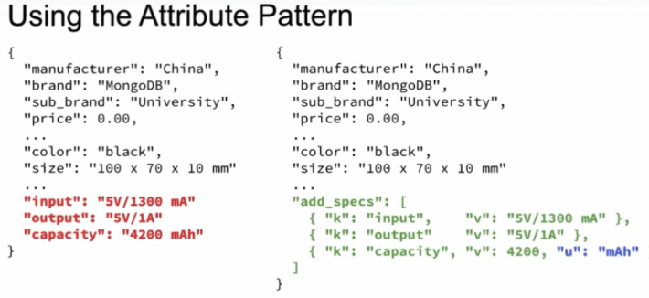

* Se crean índices para **add_specs.k** y **add_specs.v**

## Extended Reference Pattern

Las relaciones entre datos son cruciales para el rendimiento. Las formas de ejecutarlo en MongoDB son:

* Cómo en los inicios de mongodb consiguiendo de la BD 2 lecturas secuenciales de datos relacionadas entre sí.
* $lookup de aggregation Framework para recuperar datos relacionados
* $graphLookup de aggregation Framework para ejecutar queries recursivas sobre la misma colección.

Y por último y lo que ocupa este patrón, es:

* Embeber una relación 1-* en el *one side*

Un ejemplo es la dirección de un cliente para sus pedidos en un servicio. Se puede copiar sólo la dirección del cliente a la orden de pedido y de esta forma no  se necesitará consultar (con regularidad al menos) nada en otro documento, sino que toda la información necesaria estará junta.

Reglas:

* Seleccionar para duplicar sólo piezas que no vayan a modificarse en su clonado
* Duplicar sólo campos que vayan a ser totalmente necesarios

## Subset Pattern

Para evitar problemas en la caché de mongodb es necesario no ser burro y usar documentos gigantescos cuya información completa rara vez se necesita.

Un target de MongoDB en el modelado de información es pensar en cóm será consumida ésta.

**<u>Working Set</u> se refiere a la cantidad de espacio tomado por los documentos y porciones de índices que son frecuentemente accedidos.**

Formas de reducir documentos:

* Las reviews de una película: Mantener sólo las 10 más importantes y el resto envirlas a otro documento
* Lo mismo para la lista de actores completa de una película, mantener los X más importantes y el resto  otro documento.

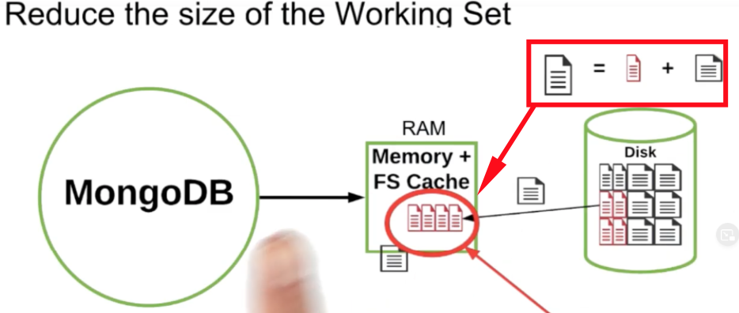

## Computed pattern

* Operaciones matemáticas
* Operaciones FanOut
* Operaciones RollUp

### Operaciones matemáticas

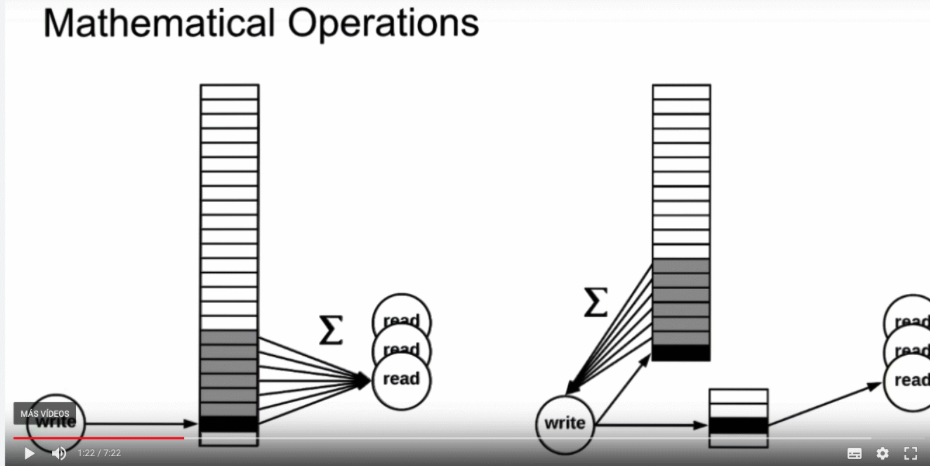

Suma, media, mediana, etc

Suelen asociarse a funciones de servidor.

Si se hace una escritura y posteriormente se tiene que volver a hacer un cálculo leyendo todos los elementos responsables de esa operación matemática por cada vez que se necesite saber esa operación matemática: por 1 escritura se puede reproducir múltiples (del orden de cientos o miles) de operaciones de lectura.

La idea es realizar el cálculo para la operación matemática a continuación de la escritura y almacenarlo en otro documento para que su lectura sea inmediata, y no se haga la operación por cada lectura. Ya no se tendrán que leer los registros sino el resultado del cálculo matemático esperado.

Con esto se reduce drásticamente las lecturas a BBDD como el tiempo de computación en el servidor por cada lectura.

### Operaciones FanOut

* FanOut Reads: devolver los datos apropiados tras la inserción, la query debe consultr de diferentes localizaciones o tu te encontraras en un FanOut Writes.
* FanOut Writes: Significa que cada operación se traduce en la escritura en diferentes documentos. (lectura roe: ya sea por organizaión o duplicación para facilitar lecturas). Se hace esto para que la lectura sea directa y no haya un fanout reads.

Debemos intentar hacer fanout writes.

	Un buen ejemplo es una rrss: cuando alguien escribe algo, se le coloca en el “mural” de los usuarios que lo siguen, de forma que cuando el usuario quiere ver su “muro” sólo tiene que recuperar la información de su muro, y no escarvar en qué ha publicado alguién desde la última visualización.

### RollUp Operations

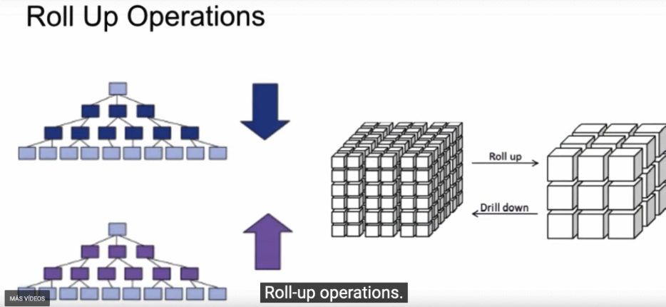

* RollUp: 
  * Juntamos datos, por ejemplo, agrupando cateogrías en un categoría padre.
  * Agrupar los datos basados en el tiempo desde intervalos pequeños a grandes será otro buen ejemplo de roll-up . Este tipo de rollup se ve a menudo en los informes de resúmenes horarios, diarios, mensuales o anuales.
  * Cualquier operación que quiera ver los datos a un nivel alto está básicamente buscando un roll-up de datos

**¿Cuándo usar este patrón?**

* Sobreuso de los recursos
* Reducir latencia para operaciones de lectura

## Bucket Pattern

#### Ejemplo 1: IoT

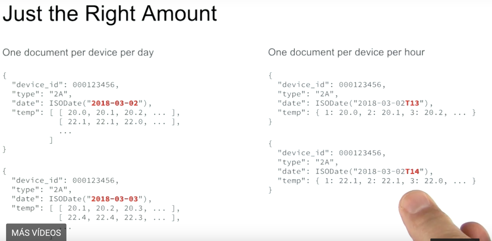

Como ejemplo se pone el almacenamiento de información de 10 millones de sensores de temperatura que envían información cada minuto. Esto supone 36 billones de ítems por hora.

* ¿Guardar la información de cada tipo de sensor en un documento? Al tener 36 billones de items por hora, tendremos muchos documentos que manejar.
* ¿Guardar la información de un dispositivo en un documento? esto hará alcanzar rápidamente el límite de 16 MB por documento.

¿Cómo solucionarlo?

* Sugerencia 1: Tener un documento por dispositivo y por día. También se crea un array por hora, de forma que cada ítem del array representa una hora del día. Se tiene mejor organizada la información.
  * El problema es que una operación común será tener un cálculo de media  y por tanto se tendrá que recuperar una posición concreta del array y realizar el cálculo.
* Sugerencia 2: Tener un documento por dispositivo y por hora. En lugar de almacenar los valores recibidos en un array "secuencial" que tendremos que rellenar con valores nulos cuando no se reciba información, si lo hacemos en un documento clave:valor, podemos usar la clave para el minuto concreto en el que se ha recibido. `Query Focus`

#### Ejemplo 2: Chat messaging

Muchos canales.

Alternativas de diseño:

* Un documento por mensaje
* Un documento por chat (grupal o p2p)
* Un documento por chat (grupal o p2p) y por día
  * Es fácil eliminar los chats más viejos de X días
  * O archivarlos

#### Ejemplo 3: Column based vs Row based approach

El uso de column based es muy útil cuando se quiere operar con los datos de un campo de una tabla, por ejemplo para realizar operaciones matemáticas, ya sean sobre números o enumerados textuales.

Ahora vamos a ver cómo encajar un modelo para column based en MongoDB.

Normalmente usarías un documento por día para almacenar la información de diferentes sensores, para mejorar su uso y ser más cercano a las bondades de las column oriented, podríamos almacenar en documentos individuales la información de cada sensor.

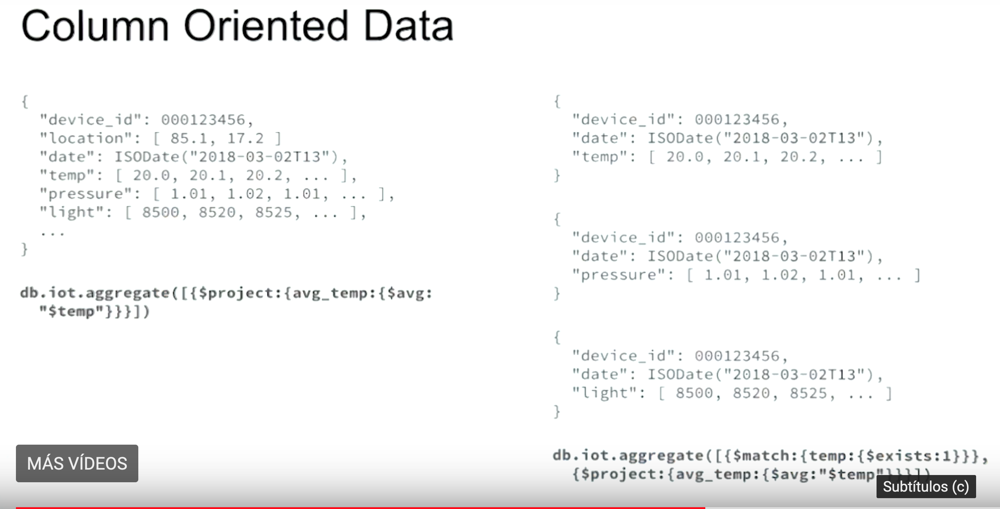

#### RESUMEN

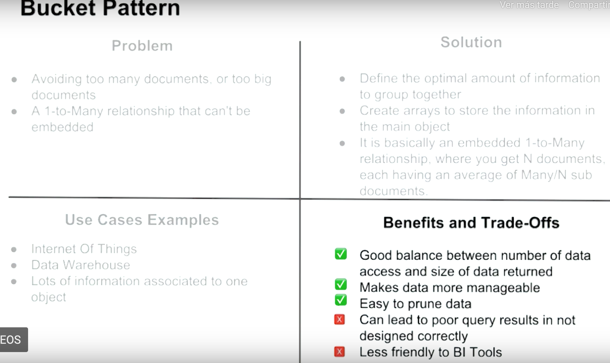

## Schema versioning

* Establecer una versión de schema
* Actualización:
  * Por lotes en background
  * In real time como TMDu

## Tree Patterns

1. Parent References
2. Child References
3. Array of Ancestors
4. Materialized Paths

¿Cuándo es mejor uno que otro?

1. **Parent Ref:** 
   
   * Con aggregation pipeline podemos conseguir todos los padres con un graphLookup
   
   * Para encontrar todos los hermanos, podemos correr un comando para encontrar quienes tengan "nuestro" padre.
   
   * Por lo tanto es fácil cambiar algo en todos los hijos de un mismo padre
   
   * | Ventajas                                                     | Desventajas                                                  |
     | ------------------------------------------------------------ | ------------------------------------------------------------ |
     | * Conocer los hijos de X * Cambiar atributos de N bajo P | * Quienes son los antepasados de un nodo X? * Encontrar todos los nodos que están bajo Z |
2. **Child Ref:**

   * El nodo contiene un array con una referencia de todos sus hijos: `children: ["Books","Electronic","Stickers"]` para un árbol de categorización de productos.
   * | Ventajas                                     | Desventajas                                                  |
     | -------------------------------------------- | ------------------------------------------------------------ |
     | * Encontrar todos los nodos que están bajo Z | * Conocer los hijos de X * Cambiar atributos de N bajo P * Quienes son los antepasados de un nodo X? |
3. **Array of Ancestor:**
   
   * El nodo contiene un listado de sus padres hasta el nodo raíz, ordenados desde la raíz
   * | Ventajas                                                     | Desventajas                                                  |
     | ------------------------------------------------------------ | ------------------------------------------------------------ |
     | * Conocer los hijos de X * Quienes son los antepasados de un nodo X? | * Cambiar atributos de N bajo P * Encontrar todos los nodos que están bajo Z |
4. **Materialized Paths:**
   
   * Se usa una cadena de texto para representar la lista de padres en ligar de hacerlo sobre un array como el caso anterior: `ancestors: '.Swag.Office'`
   
   * Se pueden usar expresiones regulares para hacer búsquedas rápidas en todo el árbol
     
   * Se puede usar un único índice para encontrar un path específico  de una rama de nuestro árbol.
     
   * 
     
     | Ventajas                 | Desventajas                                                  |
     | ------------------------ | ------------------------------------------------------------ |
     | * Conocer los hijos de X | * Quienes son los antepasados de un nodo X? * Encontrar todos los nodos que están bajo Z * Cambiar atributos de N bajo P |

La gracia de los tree pattern es que se pueden mezclar a conveniencia, por ejemplo, podemos tener Ancestor Array + Parent Reference de forma que:

| Ventajas                                                     | Desventajas                                                  |
| ------------------------------------------------------------ | ------------------------------------------------------------ |
| * (Ancestor & Parent) Conocer los hijos de * (Ancestor) Quienes son los antepasados de un nodo X? * (Parent) Cambiar atributos de N bajo P | * (Ancestor &Parent) Encontrar todos los nodos que están bajo Z |

#### Resumen

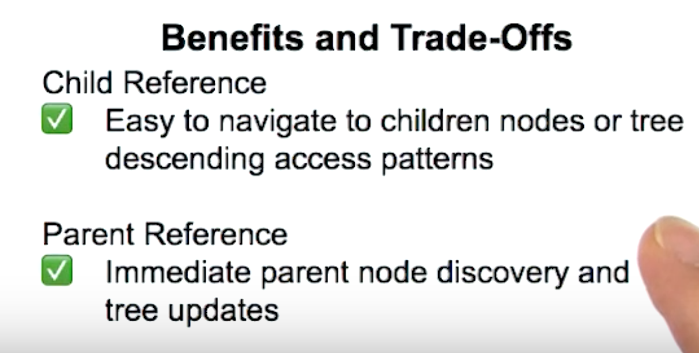

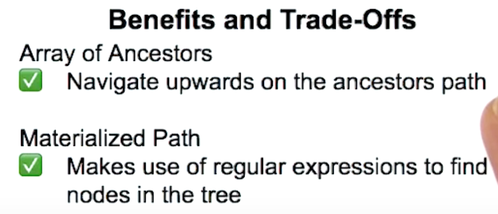

## Approximation Pattern

Usado para reducir el numero de recursos necesarios para ejecutar algunas operaciones de escritura.

**Ejemplo:** Si una aplicación quiere registrar el numero de visiones de una página,podría escribir en bbdd cada vez que una página es vista, pero podría sobrecargar la bbdd enseguida con cientos de escrituras extra por día.

En este caso, una función de aproximación puede ser usada para incrementar el contador sólo una vez cada poco en lugar de hacerlo por cada vez que se produce el evento.

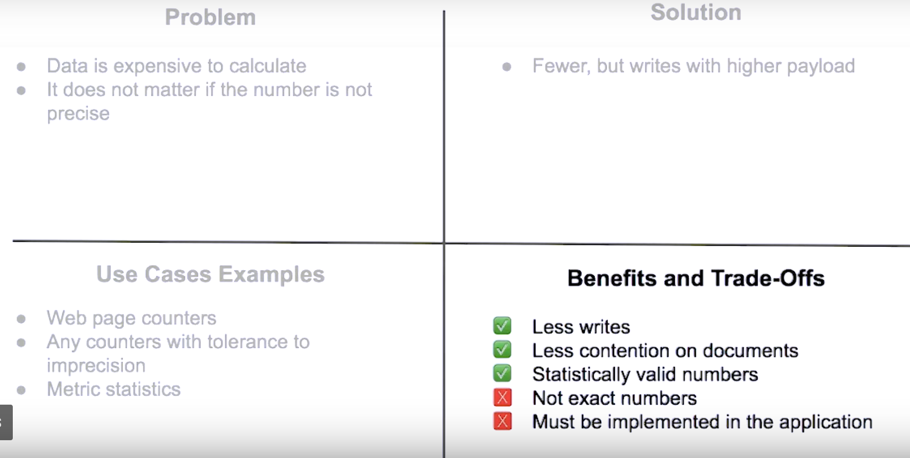

## Outlier Pattern (Patrón de valores atípicos)

**Ejemplo:** La mayoría de los usuarios de una red social tienen <1000 seguidores, pero hay algunas cuentas de usuarios (famosos por ejemplo) que tienen millones de seguidores.

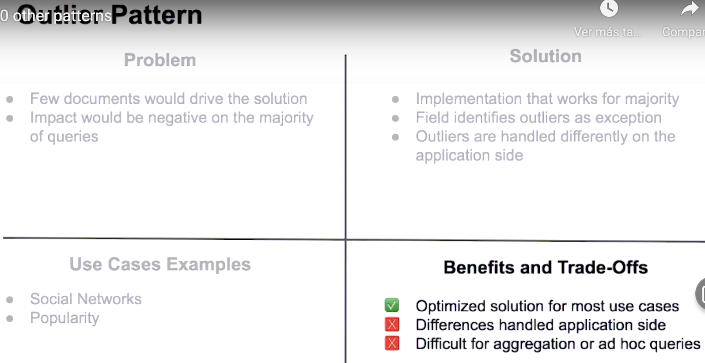

**Otro ejemplo:** Una película que tiene más de 1000 extras en la película

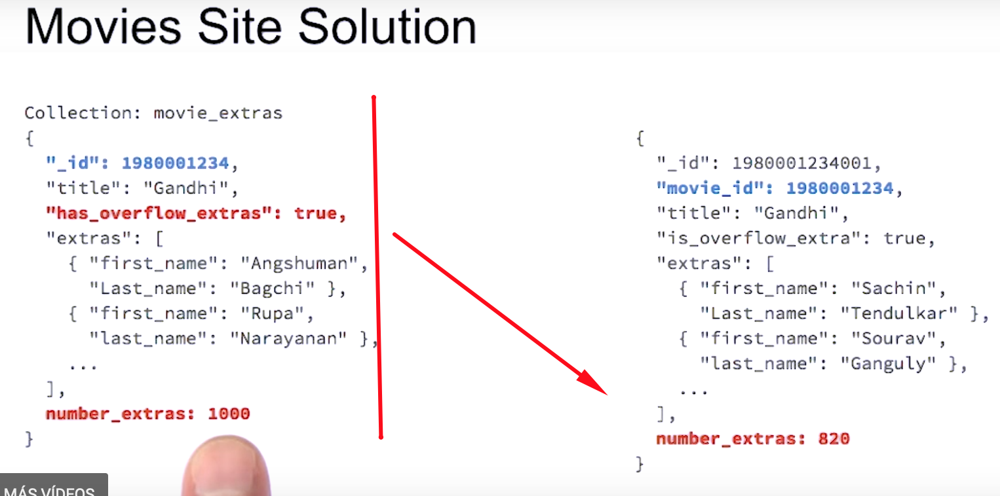
