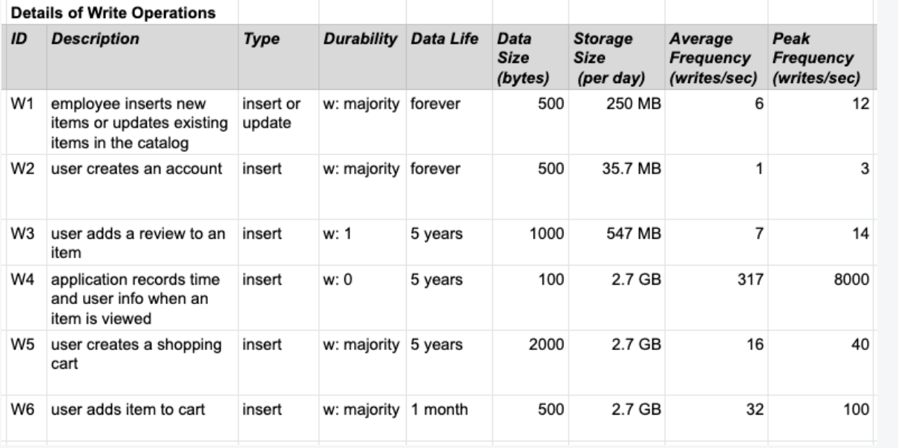
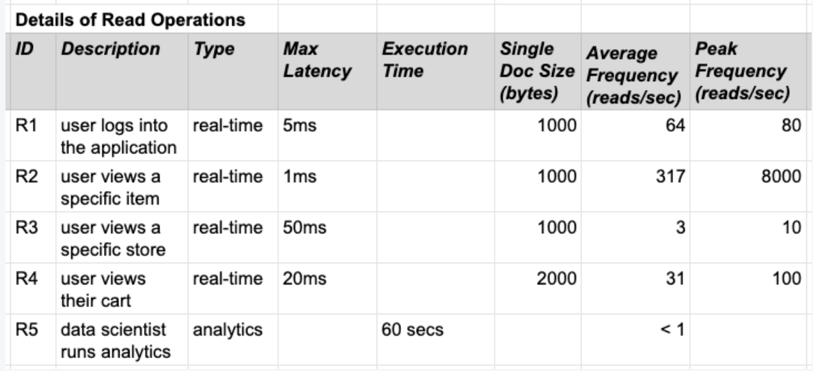
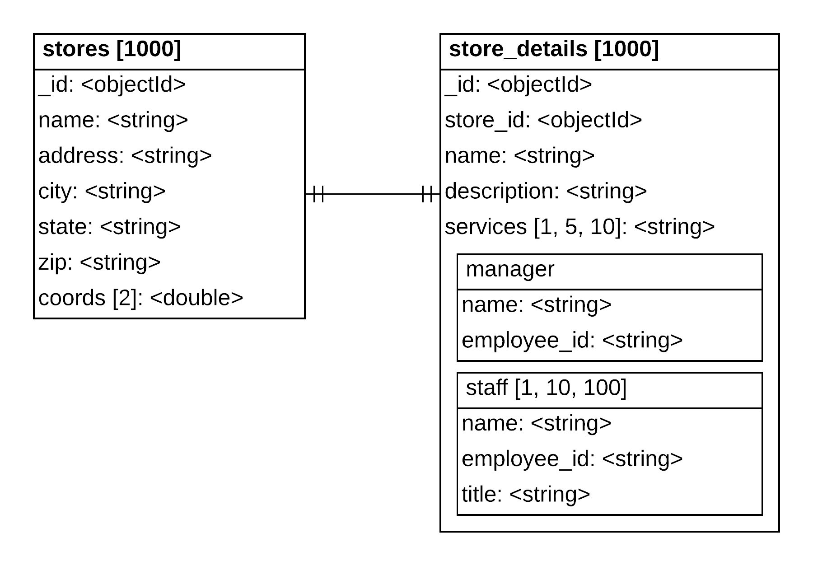
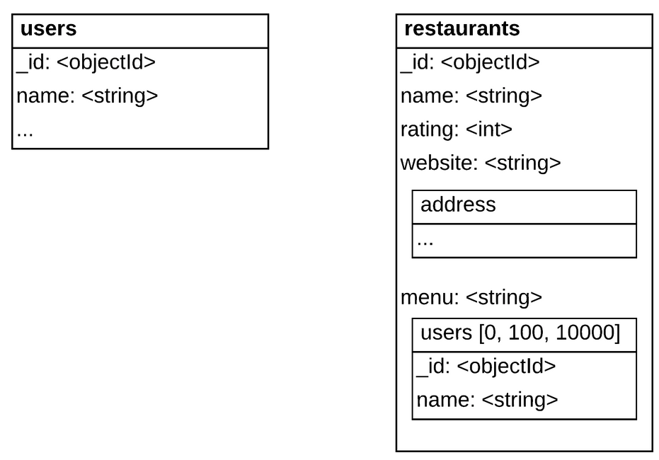
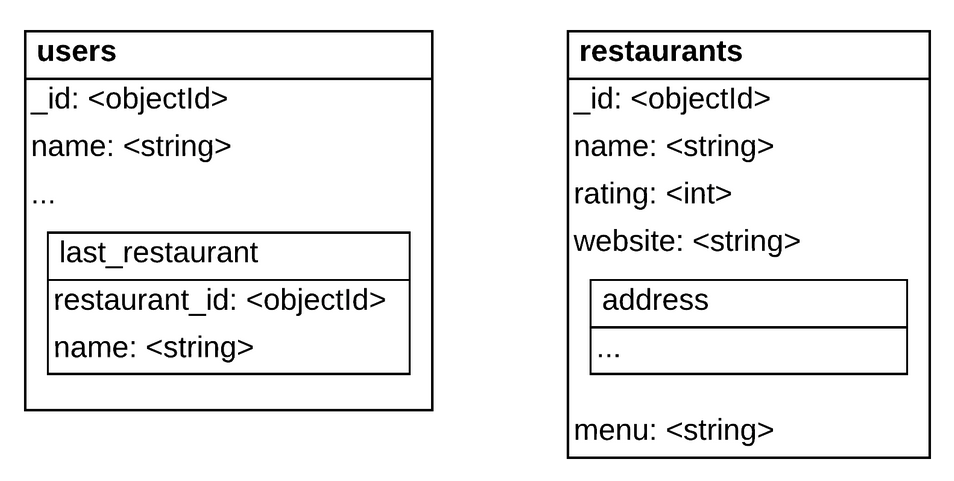
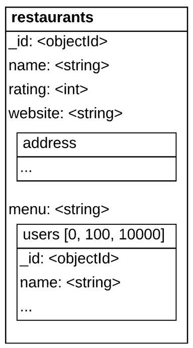
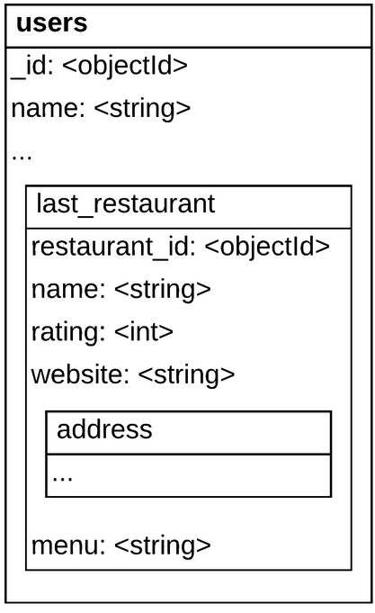
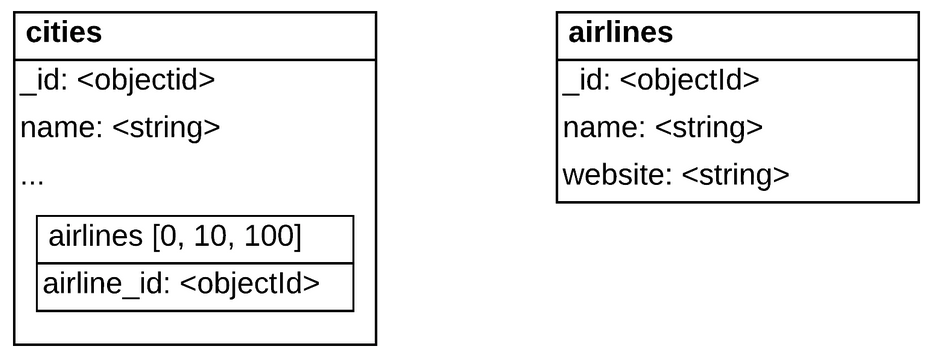
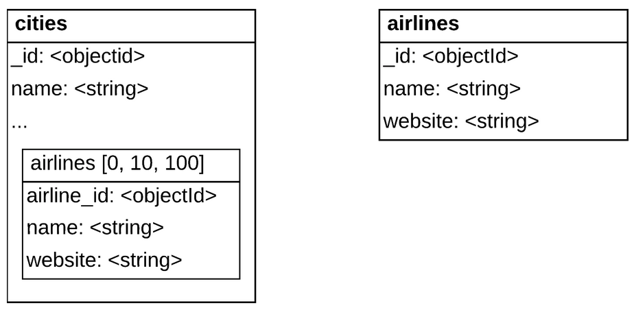
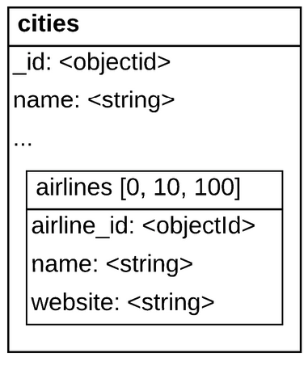

# Final Exam: Question 1

Problem:

**Scenario**

Consider the following information about the operations on a system:

**Write Operations**

> - **ID** - A unique value to identify each operation.
> - **Description** - A summary of the action occuring in the application that triggers this operation.
> - **Type** - Additional information about whether this operation is an insert operation or an update operation.
> - **Durability** - The number of nodes that must write the data to the database for the operation to be considered complete.
> - **Data Life** - The amount of time this record will be stored in the database.
> - **Data Size** - The number of bytes being written to the database.
> - **Storage Size** - The amount of additional storage needed per day to store all new write data for this operation.
> - **Average Frequency** - The average number of times this operation occurs per second.
> - **Peak Frequency** - The average number of times this operation occurs per second at peak hour frequency.

**Read operations**

> - **ID** - A unique value to identify each operation.
> - **Description** - A summary of the action occuring in the application that triggers this operation.
> - **Type** - Additional information about whether this operation is a real-time operation or an analytics operation.
> - **Max Latency** - The maximum acceptable amount of time for the application to wait to receive data from the database.
> - **Execution Time** - The average amount of time the operation takes to complete. This is only filled in if the amount of time is longer than 1 second.
> - **Single Doc Size** - The average size of the document being retrieved.
> - **Average Frequency** - The average number of times this operation occurs per second.
> - **Peak Frequency** - The average number of times this operation occurs per second at peak hour frequency.

Which of the following operations is the one that should be considered most prominently when designing our schema? Choose the best answer:

W4 - application records time and user info when an item is viewed.

W6 - user adds item to cart.

R1 - user logs into the application.

R2 - user views a specific item.

R4 - user views their cart.

**Respondí primero W4, luego R4 y por último R2.**

## Resultado

**Correct Option**

- R2 - user views a specific item.

This is the operation, alongside its corresponding write W4, that occurs most often at peak times.

R2 has a very low expected latency of 1 millisecond.

This will drive the design to reduce the number of queries when retrieving this information. For example, embedding as much necessary information as possible in the product will help to reduce such queries.

------

**Incorrect Options**

- W4 - application records time and user info when an item is viewed.

A hint that W4 is not as important as R2 is the durability of `w: 0`. This write concern means that the application is not going to wait for a confirmation that any nodes completed the write successfully, meaning that the application is not very concerned with its success.

- W6 - user adds item to cart.

These writes are very important, and we will use the appropriate write concern and catch the error conditions in the code. However, they do not appear as frequently as the more important R2 reads, so we shouldn't build our system around these writes.

- R1 - user logs into the application.

This is one of the most imporant operation, because without it being fast, you may lose customers. However there are a lot more views of items, especially at peak time.

- R4 - user views their cart.

This is also another very important operation, as the customer may be ready to commit on purchasing items, however here again, this operation does not happen as often as the views of items.

# Question 2

We built a very successful navigation application for cell phones. The application has been installed on many devices throughout the world.

Over a long period of time, the application is active on an average of 10 million cell phones, with a maximum peak of 50 million devices at the busiest time of the year. This average value includes all of the peaks.

Each device, when active, sends 100 bytes of data every minute, which the server writes as one operation.

We want to keep the data for one year.

Based on the above numbers, which of the following are true statements regarding the quantification of this workload and the sizing of the database?

To simplify the calculations and conversions in data units, use:

- 1,000,000,000 bytes is 1 gigabyte
- 1,000,000,000,000 bytes is 1 terabyte
- 1,000,000,000,000,000 bytes is 1 petabyte

and round all results to 2 significant digits.

1. The size of the data in the database is 2.6 terabytes.
2. The size of the data in the database is 530 terabytes.
3. The size of the data in the database is 2.6 petabytes.
4. The peak write rate is 17,000 writes/second.
5. The peak write rate is 170,000 writes/second.
6. The peak write rate is 830,000 writes/second.
7. The average write rate is 17,000 writes/second.
8. The average write rate is 83,000 writes/second.
9. The average write rate is 170,000 writes/second.

## Result

**Correct Options**

- The size of the data in the database is 530 terabytes.

  This is the amount of space needed to keep the data for a one year period.

  10,000,000 cellphones * 100 bytes/(minute*cellphone) * (60 * 24 * 365 minutes/year)

- The peak number is 830,000 writes/second.

  50,000,000 cellphones/minute *  1 minute/60 seconds

- The average write rate is 170,000 writes/second.

  10,000,000 cellphones/minute *  1 minute/60 seconds

**Incorrect Options**

All other provided numbers are incorrect.

# Question 3

Problem:

Given the following *Collection Entity Diagram*.

Which of the following pairs of data have a One-to-One relationship between them?

* stores._id` and `store_details.services
* store_details.name` and `store_details.staff.name
* stores.name` and `store_details.description
* stores.name` and `store_details.staff.name
* stores.address` and `store_details.manager.name
* store_details.manager.employee_id` and `store_details.staff.employee_id
* stores.name` and `stores.city

## Resultado

**Correct Options**

- `stores.name` and `stores.city`

- `stores.name` and `store_details.description`

- `stores.address` and `store_details.manager.name`

  Because our entities **stores** and **store_details** are joined by a One-to-One relationship, it does not matter in which of those two entities the fields are located.

  What matters is that a field is not within an array field, which are our only fields representing One-to-Many relationships.

  All the above options have a One-to-One relationship between the pair of fields.

**Incorrect Options**

- `store_details.name` and `store_details.staff.name`
- `stores._id` and `store_details.services`
- `store_details.manager.employee_id` and `store_details.staff.employee_id`
- `stores.name` and `store_details.staff.name`

# Question 4

Problem:

We are building a social media site where users can share a lot of details about their whereabouts in their lives.

The site will likely have many European customers. For all these users, the GDPR law in Europe cites that a person has the right to be forgotten, meaning all data related to that person should be erased per request of the user.

Which one of the following implementations would be the preferred way to represent the One-to-Many relationship between restaurants and each user's last-visited restaurant to enable easy removal of a user's activity in accordance with GDPR?

1. A **restaurants** collection with references to **users** documents
   
2. A **users** collection with an extended reference to a **restaurants** document.
   
3. Only a **restaurants** collection in which all user information is embedded.
   
4. Only a **users** collection in which all restaurant information is embedded.
   

## Result

**Correct Option**

- A **users** collection with an extended reference to a **restaurants** document.

  Because the main focus of the queries are the **users**, we must have a collection for them.

  And because of GDPR, it is easy to delete a user with all the information about it. If the user information was also located in the restaurant document, we would have to also search for this information and delete it.

  The Extended Reference to the restaurant also allows our application to know the restaurant name without having to do an additional query when we look at a user.

**Incorrect Options**

- Only a **restaurants** collection in which all user information is embedded.
- Only a **users** collection in which all restaurant information is embedded.
- A **restaurants** collection with references to **users** documents.

# Question 5

Which of the following are recommended ways to model a Many-to-Many relationship between airlines and the cities those airlines fly between?

1. Referencing the **airlines** documents in each of the corresponding **cities** documents.
   
2. Embedding the airlines that fly to/from a city in each of the corresponding **cities** document and keeping a separate copy of the **airlines** documents.
   
3. Embedding the airlines that fly to/from a city in each of the corresponding **cities** document, without having a separate collection for the airlines.
   

## Result

**Correct Options**

- Embedding the airlines that fly to/from a city in each of the corresponding **cities** document and keeping a separate copy of the **airlines** documents.

  This is a good representation. To be able to store an airline that is not associated with any city yet or to be able to resolve issues between the duplicated information about the airlines, it is recommended to keep a source of truth as a separate collection.

- Referencing the **airlines** documents in each of the corresponding **cities** documents.

  This is a valid representation for a Many-to-Many relationship. This form avoids duplication, however, it may lead to more queries.

**Incorrect Option**

- Embedding the airlines that fly to/from a city in each of the corresponding **cities** document, without having a separate collection for the airlines.

  This representation is not recommended for a Many-to-Many relationship. Deleting the only parent document in which an airline document is embedded would make the airline vanish too, which may not be the desired behavior.

  Also, because embedding a Many-to-Many relationship creates duplication, keeping a source of truth in an outside collection may prevent issues in case the duplicated information gets out of sync between documents.

# Question 6

Consider a system that collects census data on all countries in the world.

Which of the following implementations are recommended ways to model a One-to-Zillions relationship between a person entity and the country entity in which that person was born?

1. Embedding as an array. In the document for a country, we embed all the people born in that country.
2. Referencing from the Zillions side. In each person document, we reference the corresponding country document.
3. Referencing from the One side. In the document for a country, we have an array of references to the documents of the people who are kept in a separate collection.

## Result

**Correct Option**

- Referencing from the Zillions side.

  This is the preferred representation for a One-to-Zillions relationship.

**Incorrect Options**

- Embedding as an array.

  Because we are talking about more than a billion people being born in the same country, putting these people in the document for the country would create a gigantic document, exceeding the limitation on the document size.

- Referencing from the One side.

  Even just keeping the references to people in the document for a given country would create a document exceeding the limitation on the document size.

# Question 7

Your team just hired a new Data Architect, and her amazing ideas are gaining traction with the company leadership.

You already updated your application to be able to handle the new data organization in your database. Now you have been tasked with implementing her proposed new data organization approach to your database with minimum downtime for the users of the application.

Which pattern solution is best suited for this situation?

1. The Schema Versioning Pattern
2. The Subset Pattern
3. The Attribute Pattern
4. The Bucket Pattern
5. The Extended Reference Pattern

## Result

**Correct Option**

- *The Schema Versioning Pattern*

  This pattern allows for the application to quickly identify which document structure it is dealing with, the old one or the new. This helps to minimize downtime for the application user, while allowing the database to smoothly transition to the new schema.

**Incorrect Options**

- *The Attribute Pattern*
- *The Bucket Pattern*
- *The Extended Reference Pattern*
- *The Subset Pattern*

# Question 8

A new decision maker came aboard your online bookstore team. They want to be able to track which genres are most popular daily. To keep this metric up to date without running massive queries for obtaining it, which of the following schema patterns would you choose to implement?

1. The Polymorphic Pattern
2. The Subset Pattern
3. The Computed Pattern
4. The Bucket Pattern
5. The Extended Reference Pattern

## Result

**Correct Option**

- *The Computed Pattern*

  The Computed Pattern allows your application to calculate values at write time. In this case, the sum of the number of views would be calculated in a rolling fashion by book genre.

**Incorrect Options**

- *The Bucket Pattern*
- *The Extended Reference Pattern*
- *The Polymorphic Pattern*
- *The Subset Pattern*

# Question 9

You work as a developer at a factory. Your factory wants to track the usage statistics of the automatic lighting that was recently installed throughout its facilities. The lights send an update to the database every 10 seconds, but the management is interested in an hourly report instead. Additionally, we are only looking to store this information for at most 5 years, so an easy way to purge old data would be beneficial to our data modeling approach.

Which pattern solution is best suited for this situation?

1. The Computed Pattern
2. The Extended Reference Pattern
3. The Bucket Pattern
4. The Polymorphic Pattern
5. The Subset Pattern

## Result

**Correct Option**

- *The Bucket Pattern*

  The *Bucket* pattern allows us to record data in hour interval documents, which can then be stored in yearly collections. This makes it easy to store, analyze, and purge the data within the given time requirements.

**Incorrect Options**

- *The Computed Pattern*
- *The Extended Reference Pattern*
- *The Polymorphic Pattern*
- *The Subset Pattern*

# Question 10

With the digitization of every area of our lives, the famous NYC bodegas (convenience stores) are trying to keep up. Bodegas don't just know everything that goes on in the neighborhood, they also supply all types of household goods, hardware supplies, and groceries. The New York City Bodega Association is looking to create an app that will help them keep track of their unique, versatile inventory and help customers look up whether items are in stock before visiting the bodega.

Which pattern solution is best suited for this application?

1. The Bucket Pattern
2. The Subset Pattern
3. The Extended Reference Pattern
4. The Polymorphic Pattern
5. The Computed Pattern

## Result

**Correct Option**

- *The Polymorphic Pattern*

  The problem states that bodegas sell a variety of items from different categories, with different purposes and properties. In this case, the Polymorphic Pattern will be the best candidate to catalog this set of goods.

**Incorrect Options**

- *The Bucket Pattern*
- *The Computed Pattern*
- *The Extended Reference Pattern*
- *The Subset Pattern*

# Question 11

You are a developer working on an e-commerce application. Each time your application retrieves an item from the **inventory** collection, it also needs to retrieve data about the orders in which this item is present. This leads to additional queries on the **orders** collection.

We know that reducing the total number of queries we perform on the system would solve the main performance issue we are seeing at peak time.

Which pattern solution is best suited for this situation?

1. The Polymorphic Pattern
2. The Schema Versioning Pattern
3. The Computed Pattern
4. The Bucket Pattern
5. The Extended Reference Pattern

## Result

**Correct Option**

- *The Extended Reference Pattern*

  In this case, the Extended Reference Pattern will easily take care of the additional queries our application is making. To implement the pattern we can modify the **inventory** item documents by adding frequently-accessed **order** data directly to them. This will result in lowering the number of related queries on the **orders** collection, since the relevant data about the orders will now be part of the **inventory** item documents.

**Incorrect Options**

- *The Bucket Pattern*
- *The Computed Pattern*
- *The Polymorphic Pattern*
- *The Schema Versioning Pattern*

# Question 12

As a chemical manufacturer, you tend to keep your factory and your data organized, since dealing with chemicals requires a lot of precision, attention, and safety mechanisms. One of the safety mechanisms in the factory is the documentation about produced chemicals. This documentation is recorded in **Material Safety Data Sheets** which are large pdf documents containing safety details about a given chemical. These Data Sheets are part of the documents in the **inventory** collection, where other information such as the price, quantity, and warehouse location of the chemical is stored as well.

Keeping track of production, sales, and purchases requires a lot of data manipulation on an hourly basis. You notice that at especially busy times, your inventory tracking application slows down by a lot.

Which pattern solution is best suited for solving this issue?

1. The Computed Pattern
2. The Bucket Pattern
3. The Subset Pattern
4. The Extended Reference Pattern
5. The Polymorphic Pattern

## Result

**Correct Option**

- *The Subset Pattern*

  In this case, it seems that the application is slowing down because of the amount of data that is being retrieved each time an item is accessed. To eliminate this issue, the Subset Pattern would be a perfect solution. We can store the **Material Safety Data Sheets** in a separate collection and only access them when it is necessary.

**Incorrect Options**

- *The Bucket Pattern*
- *The Computed Pattern*
- *The Extended Reference Pattern*
- *The Polymorphic Pattern*
